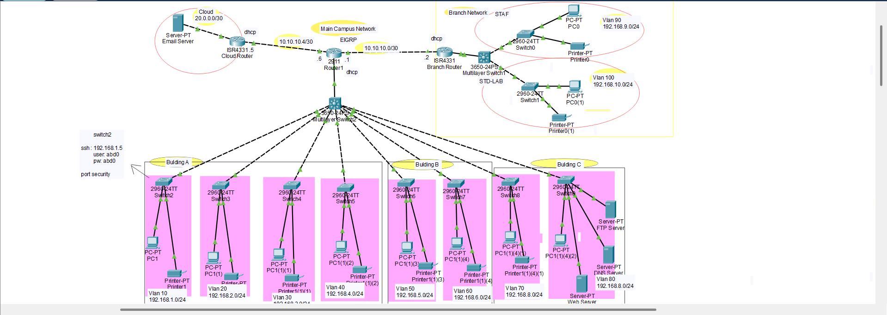

# Enterprise Network Simulation (Cisco Packet Tracer)

## 📌 Project Overview
This project involves the design and simulation of a comprehensive, large-scale enterprise network architecture using **Cisco Packet Tracer**. The network is designed to emulate a real-world corporate environment, connecting a **Main Campus**, a **Remote Branch**, and **Cloud Services**. It follows the industry-standard **Hierarchical Network Model** (Core, Distribution, and Access layers) to ensure high scalability, reliability, and ease of management.

## 🏗️ Network Architecture & Topology
The topology is divided into several logical and physical segments:
* **Main Campus Network:** Features a hierarchical design with multi-layer switches (3650-24PS) acting as the distribution layer to manage high-speed data flow and routing.
* **Branch Network:** A remote site connected via a high-speed serial link, utilizing its own local infrastructure for staff and labs.
* **Cloud Integration:** Simulation of an external cloud router (ISR 4331) providing connectivity to centralized email servers.
* **Building-Specific Subnets:** The infrastructure is further divided into separate buildings (Building A, B, and C), each housing dedicated departments and server rooms.

## 🚀 Key Features & Technical Implementation

### 1. Network Segmentation (VLANs)
To optimize traffic and enhance security, the network is segmented into **10+ distinct VLANs**, ranging from VLAN 10 (Building A) to VLAN 100 (Lab Staff). This ensures that broadcast domains are limited and departmental traffic is isolated.

### 2. Dynamic & Inter-VLAN Routing
* **EIGRP (Enhanced Interior Gateway Routing Protocol):** Implemented for fast-converging, dynamic routing across the campus and branch routers.
* **Inter-VLAN Routing:** Configured on multi-layer switches and ISR routers to facilitate communication between different departments while maintaining control.

### 3. Enterprise Services Deployment
Integrated a full suite of enterprise-grade services within the network:
* **DNS & Web Servers:** For local domain resolution and internal web hosting.
* **FTP & Email Servers:** Configured to handle file transfers and corporate communication.
* **DHCP Services:** Routers are configured to act as DHCP servers, providing automated IP provisioning across the various VLANs.

### 4. Advanced Security Controls
Applied a "Defense in Depth" strategy by implementing multiple security layers:
* **Access Control Lists (ACLs):** Defined to filter traffic and prevent unauthorized access to sensitive server segments.
* **Port Security:** Configured on access-layer switches to prevent MAC-address-based attacks.
* **DHCP Snooping:** Mitigates rogue DHCP server attacks by ensuring only trusted ports can provide IP addresses.
* **Secure Management (SSH):** Enabled SSH for secure remote device administration, replacing insecure Telnet.

## 🛠️ Tools Used
* **Cisco Packet Tracer:** For network design, configuration, and simulation.
* **CLI (Command Line Interface):** All configurations were performed via IOS commands for routers and switches.

## 📸 Network Topology

